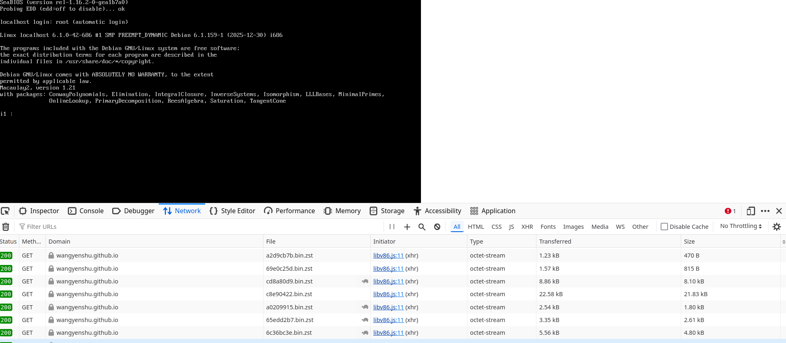

Macaulay2 in Browser

Screenshot:

How to build:

- clone this project
- delete "images" folder
- run `cd tools/docker/Macaulay2`
- run `./build.sh`
- run `./build-state.js`
- run 'cp split.sh ../../../images/split.sh'
- run `cd ../../../images`
- run './split.sh'
- run 'rm debian-9p-rootfs.tar debian-state-base.bin'
- run 'cd ..'
- run `make run`

  This should start a server on 8000 (or other ports).

Credit:
- Macaulay2: https://macaulay2.com/
- v86: https://github.com/copy/v86
- sandbox.bio's debian 12 on v86 configuration: https://github.com/sandbox-bio/v86
